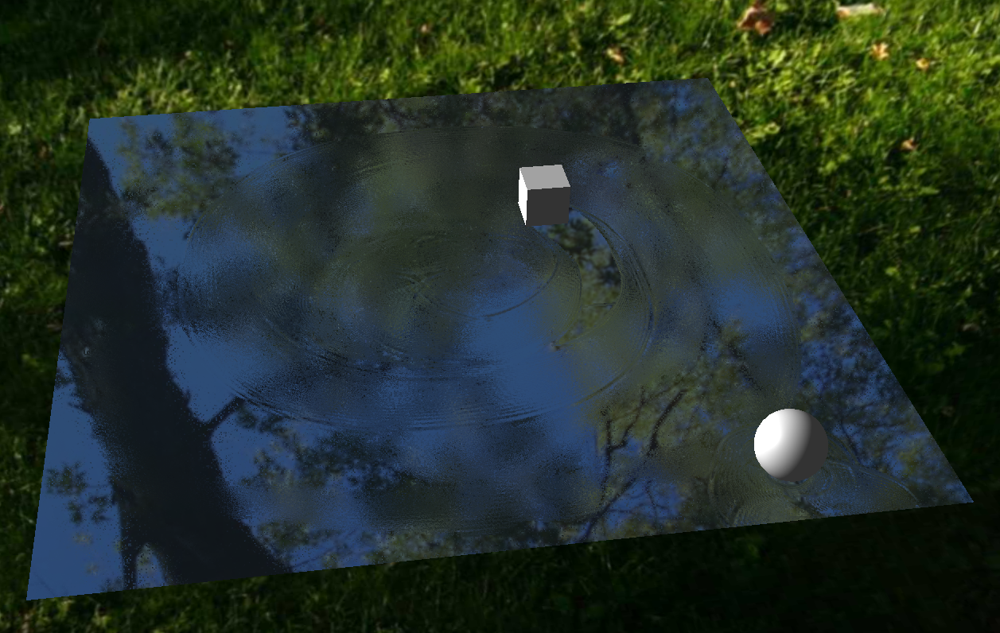

# Three.js interactive water demo
An interactive water demo using Three.JS library.

## How it works
Water physics is approximated by simulating each pixel as a particle that has momentum, vertical position and force from neighboring particles.

The height of water is then converted to a normal map and applied to a nice reflective plane.

You can check out demo [here](https://charlieamer.github.io/threejs-water/).https://charlieamer.github.io/threejs-water/